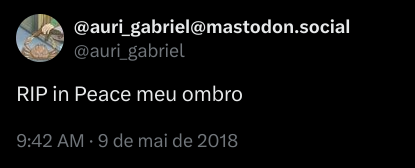

+++
title = "Visual QA Post: Images, Captions, Lists, and Dense Sections"
date = 2026-03-12
authors = ["Auri Gabriel"]

[taxonomies]
categories = ["Design", "Development"]
tags = ["typography", "content-testing", "images"]

[extra]
lead = "A second long article dedicated to stress-testing image behavior, spacing, and content density."
+++

This post is specifically designed to validate how rich content behaves on the page. It includes short and long paragraphs, inline code, image blocks, lists, and tables.

## Image handling checks

The following image helps verify max-width behavior, margin rhythm, and visual alignment inside the article flow.



If the image appears too close to neighboring paragraphs, the article body spacing is still not tuned. If it appears disconnected, spacing is too large. The sweet spot is where the image feels like a natural continuation of the narrative.

## Dense paragraph section

A professional technical blog often includes dense sections that explain trade-offs. These are the moments where weak typography breaks. We need consistent line length, strong contrast, and clear heading hierarchy.

In practical terms, this means we should be able to explain implementation details, constraints, and alternatives without the reader losing orientation. The layout should make it easy to scan first and read deeply second.

## Short checklist for publishing

- Verify all headings are meaningful and searchable.
- Ensure images have alt text and render correctly on mobile.
- Keep paragraph length moderate; break long walls of text.
- Prefer concrete examples over abstract statements.
- Add links to related posts when useful.

## Inline and block code tests

Inline example: use `zola serve` during local iteration and `zola build` before deployment.

```bash
# local preview
zola serve

# production build validation
zola build
```

## Table rendering test

| Area | What to evaluate | Result expectation |
| --- | --- | --- |
| Headings | clear visual hierarchy | easy scan |
| Body text | contrast + line height | comfortable reading |
| Lists | indentation + spacing | structured notes |
| Code blocks | overflow behavior | no broken layout |
| Images | responsive scaling | no clipping |

## Closing note

Once both long posts read comfortably, the theme is likely ready for real content. The next phase is writing consistently useful posts and letting the layout stay boring, stable, and reliable.
